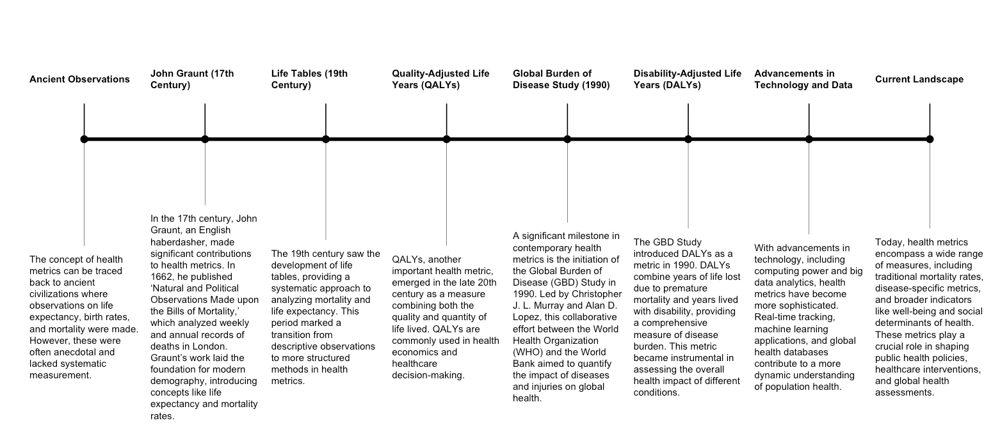

# Introduction to Metrics Evaluation {#sec-01.1-MetricsEvaluation}

```{r}
#| label: introduction-setup
#| include: false
#| echo: false

library(tidyverse)
source("R/_common.R")


#set_options()
```

<br>

*\*"The concept of health also has highly subjective connotations, precisely because it is conditioned by the personal view of happiness." René Dubos[@dubos1976]\**

<br>

The health metrics are key variables to understand more about the state of health of a population. In this first section of the book we'll learn about the history of the metrics, how to calculate them, and how to take consideration of their variation due to causes and risks. In particular, we will have a look at the metrics components and the challenges in providing standardized values for a global comparison. Moreover in the following sections we will see how to build a model, evaluate the effect of the spread of infectious disease on the health metrics and how if affects the overall state of health of a population.

## The history of health metrics

The history of health metrics is a fascinating journey that spans centuries, evolving from rudimentary observations to sophisticated statistical methods.

```{r}
#| echo: false
#| eval: false
#| message: false
#| warning: false
#| output: false
timeline <- tibble(id=seq(1,8,1),
                   type=c("Ancient Observations",
              "John Graunt (17th Century)",
              "Life Tables (19th Century)",
              "Quality-Adjusted Life Years (QALYs)",
              "Global Burden of Disease Study (1990)",
              "Disability-Adjusted Life Years (DALYs)",
              "Advancements in Technology and Data",
              "Current Landscape"),
text=c("The concept of health metrics can be traced back to ancient civilizations where observations on life expectancy, birth rates, and mortality were made. However, these were often anecdotal and lacked systematic measurement.",
       "In the 17th century, John Graunt, an English haberdasher, made significant contributions to health metrics. In 1662, he published 'Natural and Political Observations Made upon the Bills of Mortality,' which analyzed weekly and annual records of deaths in London. Graunt's work laid the foundation for modern demography, introducing concepts like life expectancy and mortality rates.",
       "The 19th century saw the development of life tables, providing a systematic approach to analyzing mortality and life expectancy. This period marked a transition from descriptive observations to more structured methods in health metrics.",
       "QALYs, another important health metric, emerged in the late 20th century as a measure combining both the quality and quantity of life lived. QALYs are commonly used in health economics and healthcare decision-making.",
       "A significant milestone in contemporary health metrics is the initiation of the Global Burden of Disease (GBD) Study in 1990. Led by Christopher J. L. Murray and Alan D. Lopez, this collaborative effort between the World Health Organization (WHO) and the World Bank aimed to quantify the impact of diseases and injuries on global health.",
       "The GBD Study introduced DALYs as a metric in 1990. DALYs combine years of life lost due to premature mortality and years lived with disability, providing a comprehensive measure of disease burden. This metric became instrumental in assessing the overall health impact of different conditions.",
       "With advancements in technology, including computing power and big data analytics, health metrics have become more sophisticated. Real-time tracking, machine learning applications, and global health databases contribute to a more dynamic understanding of population health.",
       "Today, health metrics encompass a wide range of measures, including traditional mortality rates, disease-specific metrics, and broader indicators like well-being and social determinants of health. These metrics play a crucial role in shaping public health policies, healthcare interventions, and global health assessments."))
```

```{r}
#| echo: false
#| eval: false
#| fig-align: "center"
#| fig-cap: "Health Metrics development timeline"
#| fig-alt: "Health Metrics development timeline"
timeline %>%
  ggplot(aes(x=id,y=0.5))+
  geom_segment(aes(x=id,xend=id,y=0.5,yend=0.8),linewidth=0.3)+
  geom_segment(aes(x=id,xend=id,y=0.5,yend=-1),linewidth=0.1)+
  geom_point()+
  geom_line(group=1,linewidth=1)+
  ggtext::geom_textbox(aes(label=type,y=1),
                       fontface="bold",
                       width = unit(0.13, "npc"),
                       box.size=0,
                       fill=NA,
                       hjust=0.5,
                       size=2)+
    ggtext::geom_textbox(aes(label=text,y=-1),
                       width = unit(0.13, "npc"),
                       box.size=0,
                       fill="white",
                       hjust=0.5,
                       size=2)+
  ylim(-3,2)+
  xlim(0.8,8.2)+
  coord_cartesian()+
  theme_void()
```

{fig-align="center" #fig-timeline}

\

Illustrated by @fig-timeline, one of the earliest forms of health metrics can be traced back to the work of *John Graunt*, an Englishman, in the 17th century [@johngra2024]. In 1662, Graunt published a landmark work titled "Natural and Political Observations Made upon the Bills of Mortality." Graunt defined as the **father of human demography** was largely self-educated, and his interest in mortality data was driven by the Bills of Mortality, which were weekly and annual records of deaths in London, and provided information on the number of births and deaths in the city. Graunt meticulously analyzed this **mortality data** and produced **tables** that presented various patterns and trends. His work laid the foundation for modern demography and statistical analysis. Among his notable contributions were the concepts of **life expectancy** and **mortality rates**. One of Graunt's key observations was the consistent pattern of higher mortality among infants and young children. He noted the difference in life expectancy between males and females and provided insights into factors influencing mortality, such as epidemics and seasons.

Over time, advancements in mathematics, medicine, and statistics led to the development of more sophisticated health metrics. The 19th century saw the emergence of **life tables**, which provided a systematic way to analyze mortality and life expectancy. More specifically, *Mary Dempsey* in 1940s wrote an article[@dempsey2019a] for the National Tuberculosis Association about the concept of **Years of Life Lost (YLL)**, assessing time-lost as a metric for health for the first time. She was then followed by other more advanced improvements spanning all throughout of the rest of the century.

> "The quality of life depends also on the state of "public health"-namely on factors that affect the biological welfare of the community as a whole.[@dubos1976a]

With the growth of epidemiology the 20th century was a key century for the expansion of the health metrics, the use of life table and modification of expected survival time to include weights metrics. Measures like **Quality-Adjusted Life Years (QALYs)**, and **Disability-Adjusted Life Years (DALYs)**[@murray1994a] assessed to capturing not just mortality but also the impact of diseases on overall health and well-being.

In the contemporary era, the integration of computing power and big data has further transformed health metrics. Today, we have complex models, machine learning algorithms, and global health databases that allow for real-time tracking of diseases and health outcomes.

John Graunt's work may have been a humble beginning, but it sets in motion a scientific approach to understanding population health. The journey from *Graunt's Bills of Mortality* [@johngra2024a] to today's sophisticated health metrics reflects the continuous quest to quantify and comprehend the complexities of human health and disease.

### Quality-Adjusted Life Years (QALYs)

The concept of **Quality-Adjusted Life Years (QALYs)** emerged in the late 1970s, originating from the idea of combining both the *quantity* and *quality* of life by *Joseph S. Pliskin*, then it became a widely used metric for evaluating the *cost-effectiveness* of healthcare interventions [@quality-2023]. One *QALY* corresponds to one year in perfect health, it ranges from 1 (perfect health) to 0 (dead). However, this metric, used in various sectors such as health insurance, is somewhat criticized due to its lack of addressing disparities among individuals. It might result in discrimination against individuals with specific medical conditions or disabilities.

A controversial result followed 25 years of research and studies due to the concerning validity of the metric to be inclusive. Started in the early 1989s, to step in the 2010 with the *European Commission* [@echoutco2016] which started the largest-ever study specifically dedicated to testing the assumptions of the *QALY* [@holmes2013], ending in 2013 with the recommended "not using QALYs in healthcare decision making", arguing that patients with disabilities are valued less under a QALY-based system then individuals with no disabilites. The result was then further criticized and it is still on debate.

> "Thus, medicine cannot by itself determine the quality of life. It can only help people to achieve the state of health that enables them to cultivate the art of life-but in their own way. This implies the ability to enjoy the fundamental satisfactions of the biological joie de vivre. It implies also the ability for each person to do what he wants to do and become what he wants to become, according to human values that transcend medical judgment." R.Dubos[@dubos1976a]

### Disability-Adjusted Life Years (DALYs)

It was in the 1990s when the World Bank financed a study at Harvard University to develop a sustainable index capable of considering not only the health status but also identifying the level of disabilities concerned by disparities. A new way of comparing the overall health and life expectancy of different countries was released along with the Global Burden of Disease Study in 1990 [@murray1994], a project involving *Christopher J. L. Murray* [@christop2024] and *Alan Lopez* [@alanlop2023], in collaboration with the World Health Organization (WHO), the Disability-Adjusted Life Years (DALYs) [@disabili2023a]. A metric that combines **years of life lost due to premature death** and **years lived with disability**.

Hence DALYs share a connection with the quality-adjusted life year (QALY) metric, however, while QALYs specifically represent an individual measure focusing on the benefits with and without medical intervention, the DALYs consider the overall burden of diseases.

The metric of DALYs is obtained by the sum of the **numbers of years of life lost (YLLs)** and the **numbers of years lived with disabilities (YLDs)**, and it identify the numbers of years of life lost due to death or a disability status.

The numbers of years of life lost by a population in comparison to other countries or to the Global mean trend, is based on the latest study results relative to how the well being of a country is in terms of the definition of a healthy life. To give an example, let's think about a population whose individuals are living a good life, so defined *healthy life* measured on **life expectancy** established to be 80 years on average, as most of the World population meets this as a deadline.

The part of the population who do not meet this age, but dies earlier, contributes as a building block of the numbers of years of life lost (YLLs), as well as for all that is related with a healthy living, the numbers of years spent dealing with a disability contribute to increasing the numbers of years lived with disabilities for a country's population.

To establish a *healthy life status* for a country, meaning the state of health of a population, the sum of the two values YLLs and YLDs is used to obtain the key metric of DALYs. This metric value is used to quickly identify the level of health of a population compared to a Global review based on the latest findings of the most updated studies.

In addition, this level is used to improve the proportion of countries who are in need of a better health status recognition. To be more specific, the focus on the numbers of years can help identify the areas where most of the years are lost and need for improvement, whether in facilities, research or investments.

An improvement of health at a Global level is reached when the definition of a **healthy file** is met in most of the countries where it wasn't before.

Furthermore, what we want to analyze are a series of data that are produced taking into account the tables of mortality and future life expectancy these are defined as means that these metrics have been considered important for assessing the state of health of one point population

What we refer to are the health metrics and which refer to the number of years lost due to an increase in mortality or in any case to a mortality trend that is above a certain general level which we can consider as the level optimal health globally.

### Healthy-Adjusted Life Years (HALY)

Healthy Adjusted Life Years (HALY) is a metric that combines aspects of both Disability-Adjusted Life Years (DALYs) and Quality-Adjusted Life Years (QALYs) to provide a comprehensive measure of health outcomes in a population. HALY seeks to quantify not only the burden of disease but also the overall quality of life experienced by individuals.

The HALYs measure the number of years of healthy life lived by a population, taking into account both mortality and morbidity. It incorporates information about the prevalence of diseases and disabilities, as well as the impact of these conditions on individuals' quality of life.

The calculation involves adjusting life expectancy levels based on the prevalence of health conditions and their associated disability weights. Disability weights reflect the severity of different health conditions and their impact on daily functioning. By applying these weights to the prevalence of each condition, researchers can estimate the overall burden of disease in terms of years of healthy life lost. And this is just as the same as per the calculation of DALYs.

To incorporate the *Quality of Life*, unlike DALYs, which focus primarily on morbidity and mortality, HALY incorporates measures of individuals' quality of life. This allows for a more comprehensive assessment of health outcomes that considers both the quantity and quality of life experienced by a population.

Policy implications concern about the accuracy of the HALYs to inform health policy decisions by highlighting areas where interventions are needed to improve population health and well-being. By identifying the specific health conditions that contribute most to the burden of disease, policymakers can prioritize resources and target interventions more effectively, conversely data required for a rigorous result would be hardly available and statistical simulations might take a bigger place in the assessment of the final value of this metric. Meanwhile considering it at a Global level could be favorable.

### Healthy-Adjusted Life Expectancy (HALE)

To capture fatal and non-fatal outcomes [@healthy], the health metric of HALE (Healthy Life Expectancy) is a measure of overall health and well-being that takes into account both quantity and quality of life. It is a metric that combines **years of life expectancy** with the **prevalence and severity of disability** in a population.

HALE provides a more comprehensive view of health outcomes than traditional measures of life expectancy, which only consider the quantity of life. The calculation of HALE typically involves estimating the number of years that an individual can expect to live in good health, taking into account the impact of diseases and injuries on quality of life. This information is then used to estimate the overall health status of a population. It is a useful tool for public health practitioners and policy makers, as it provides a more nuanced view of the health outcomes of a population. This information can help inform public health interventions and prioritize resources, as well as help track changes in health outcomes over time. Additionally, HALE can be used to compare the health outcomes of different populations and identify disparities in health outcomes, which can help inform targeted public health interventions.

Overall, the HALE metric provides a valuable perspective on the overall health and well-being of a population, combining information about both quantity and quality of life to provide a comprehensive view of health outcomes. It adjusts overall life expectancy by the amount of time lived in less than perfect health. This is calculated by subtracting from the life expectancy a figure which is the number of years lived with disability multiplied by a weighting to represent the effect of the disability.[^01.1-metricsevaluation-1]

[^01.1-metricsevaluation-1]: [www.healthknowledge.org.uk](https://www.healthknowledge.org.uk/e-learning/health-information/population-health-specialists/lifetables-hales-dalys-pylls#:~:text=Health%20Adjusted%20Life%20Expectancy%20(HALE)&text=It%20adjusts%20overall%20life%20expectancy,the%20effect%20of%20the%20disability.)

More info [^01.1-metricsevaluation-2]

[^01.1-metricsevaluation-2]: about the methodology https://www.un.org/esa/sustdev/natlinfo/indicators/methodology_sheets/health/health_life_expectancy.pdf

### Healthy Life Years (HLY)

The **Healthy Life Years** (**HLY**) indicator, also known as **disability-free life expectancy** (**DFLE**) or **Sullivan's Index** [@healthy2024], is a metric used to assess the number of years an individual can expect to live in good health, without experiencing significant health problems or disabilities. It is a measure of the *quality of life-adjusted life expectancy*, focusing on the years lived in full health rather than simply the total number of years lived.

It specifically focuses on the number of years a person can expect to live without disability, providing valuable insights into overall health and well-being beyond just life expectancy. It takes into account both mortality and morbidity, providing a comprehensive picture of overall health and well-being.

HLY is typically calculated by subtracting the number of years lived with disability from life expectancy at birth. The resulting figure represents the number of years an individual can expect to live in good health, free from significant health-related limitations. Unlike life expectancy, which focuses solely on the length of life, HLY incorporates measures of the quality of life by considering the impact of health conditions on individuals' ability to engage in daily activities and maintain independence.

In terms of policy implications, HLY is used to inform health policy decisions by identifying areas where interventions are needed to promote healthy aging and improve overall population health. By focusing on the number of years lived in good health, policymakers can target interventions to prevent and manage chronic diseases and disabilities effectively.

## Conclusion

These metrics are used alone or in combination with other health metrics in global health assessments conducted by organizations such as the World Health Organization (WHO), the European Commission, and the Institute for Health Metrics and Evaluation (IHME) by providing a Global perspective and insights into the health status of populations helping keeping track of the progresses towards longer terms health objectives over time.
