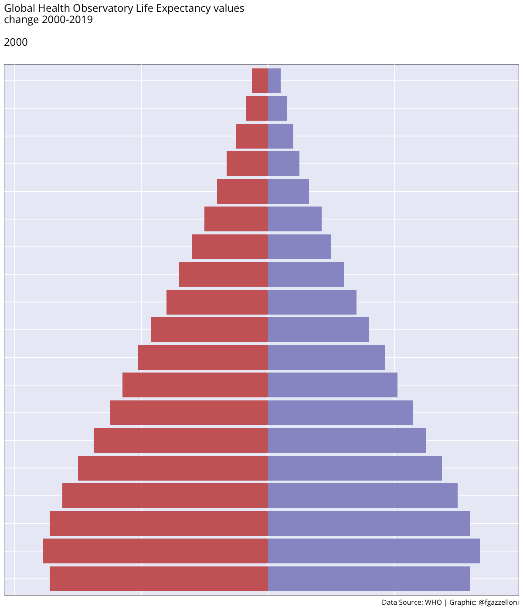

# Components of the Health Metrics {#sec-01.3-Components}

```{r}
#| echo: false
library(tidyverse,quietly = T)
source("R/_common.R")
```

::: solutionbox
::: solutionbox-header
::: solutionbox-icon
:::

Learning Objectives
:::

::: solutionbox-body
-   Life tables and Life expectancy used in the book
-   Mortality level and rates
-   Identify the disability weights
:::
:::

## Cause-specific or Population-wide

The evaluation of health metrics begins with assessing their components, which is crucial because results strongly depend on the types of **life tables**, **mortality rates**, and **disability weights** used in the analysis. The objective of the analysis, whether it is **cause-specific** or **population-wide**, can significantly impact the granularity of the health metrics components.

When calculating **YLLs**, **YLDs**, and **DALYs** for cause-specific analyses, various factors are considered, including **causes of deaths** and/or **disabilities** at specific points in time, across all ages or specific age groups, and for both sexes or only females or males. Additionally, weights used for calculating disability levels can vary depending on the type of disability and other parameters.

## Incidence and Prevalence

The incidence, even identified as the new case of a disease or injury entering the population, the cumulative incidence (risk) - $r$ is the probability the disease occurs in a specified period of time.

$$
\text{Incidence rate}= \frac{\text{number of new cases at time t}}{\text{total population at risk}}*1000
$$

The prevalence identify the burden of disease at a specific time, rather than the probability of the disease to impact on the population, it expresses the probability of suffering from a disease, it is based on the total number of existing cases among the whole population.

$$
\text{Prevalence proportion}=\frac{\text{number of existing cases at time t}}{\text{total population}}
$$

In summary, incidence measures the rate of new cases arising within a population over time, while prevalence measures the proportion of existing cases within the population at a specific point in time. Both metrics are crucial in epidemiology for understanding the dynamics and burden of diseases within populations.

### Sample calculation of Incidence and Prevalence

The incidence is the rate of new cases within a specified time frame, it provides insights into the disease's spread dynamics, while the prevalence denotes the proportion of individuals currently affected by the disease at a given point in time.

Let's simulate some virus cases for a population of 100 000 individuals over 365 days. Consider an average infection time of 5 days or 1/5=0.2 (20%) rate of infection, and average time of recovery of 20 days which corresponds to a recovery rate of 1/20=0.05 (5%)

```{r}
library(dplyr,quietly = T)

population_size <- 100000  # Number of individuals
days <- 365  # Number of days


set.seed(123)
dates <- seq(as.Date("2019-01-01"),
             as.Date("2019-12-31"), by = "day")

cases <- rpois(length(dates), lambda = 0.2)
recovered <- rpois(length(dates), lambda = 0.05)  
covid_data <- data.frame(Date = dates, Cases = cases, Recovered = recovered)
```

```{r}
#| echo: false
covid_data%>%
  head()
```

Calculate the cumulative incidence and prevalence over time:

```{r}
covid_data <- 
  transform(covid_data, 
            Cumulative_Cases = cumsum(Cases),
            Cumulative_Recovered = cumsum(Recovered))

# Calculate daily incidence and prevalence per 100,000 population
covid_data <- 
  transform(covid_data, 
            Incidence = (Cumulative_Cases /population_size)*1000,
            Prevalence = ((Cumulative_Cases-Cumulative_Recovered) / population_size)*1000)
```

```{r}
#| echo: false
covid_data%>%
  head()
```

```{r}
total_cases <- sum(covid_data$Cases)
total_recoveries <- sum(covid_data$Recovered)
```

#### Incidence and Prevalence rates for the year

```{r}
(incidence_rate <- total_cases / population_size);
(prevalence_rate <- (total_cases - total_recoveries) / population_size)
```

```{r}
ggplot(covid_data, aes(x = Date)) +
  geom_line(aes(y = Incidence, color = "Incidence"), size = 1.5) +
  geom_line(aes(y = Prevalence, color = "Prevalence"), size = 1.5) +
  scale_color_manual(values = c("Incidence" = "#29306c", 
                                "Prevalence" = "#a60845")) +
  labs(title = "Incidence and Prevalence COVID-19 Cases",
       x = "Date",
       y = "Number per 100,000 Population",
       color = "Metric") +
  theme(legend.position = "bottom")
```

## YLLs' components

The number of years of life lost YLLs is the first of the three metrics that is calculated, and is important for releasing a first look at the status of a population. First mentioned in 1947 by Mary Dempsey[@dempsey2019] to measure the burden of tuberculosis, it is built for identifying the area where improvement is required for reducing the loss in health status and clearly reducing the probability of death [@reiner2022].

The components of YLL (Years of Life Lost) include several factors that contribute to the calculation of premature death due to a disease or injury. These components are:

-   **Age at death**: The age at which a person died due to a disease or injury is a crucial component of YLL. The earlier the age at death, the greater the impact on potential years of life lost.

-   **Life expectancy**: The expected age at death in a population without the disease or injury is an important component of YLL. This value is used to compare the actual age at death with the expected age at death and determine the number of years of life lost.

-   **Standard life expectancy**: To make comparisons across populations and over time, YLL is often expressed relative to a standard life expectancy, typically set at an age of 70 years.

-   **Population size**: The size of the population affected by a disease or injury is another important component of YLL. A larger population will have a greater impact on overall YLL, regardless of the age at death.

-   **Cause of death**: The cause of death is also considered when calculating YLL, as different causes may have different impacts on potential years of life lost.

By taking these factors into account, YLL provides a measure of the potential years of life lost due to premature death caused by a disease or injury. It is an important component of the DALY, which provides a comprehensive view of the overall burden of disease on a population.

### Mortality, Life tables and Life expectancy

The selection of these key parameters is crucial for achieving the highest value of prediction of the state of health of a population. It is important to consider the objective of the analysis, if is **Cause-specific** or **Population-wide Analysis** (or Global Analysis).

The difference between an individual age at death and the arbitrary limit of life expectancy is defined as the life lost as a result of death.

#### Mortality Numbers or Rates

-   Age-specific mortality rates

-   stratification of mortality data by race and ethnicity

#### Life tables

The life tables are selected among the most frequently used, more information about how to build a like table can be found in the @sec-appendixA of this book.

```{r}
#| message: false
#| warning: false
library(tidyverse)
library(hmsidwR)
```

**hmsidwR::gho_lifetables** contains five variables:

1.  **indicator:**

```{r}
#| echo: false
#| message: false
#| warning: false
gho_lifetables %>%
  count(indicator) %>%
  select(indicator) 
```

2.  **age group:** from \<1 to 85+ in 5-year classes

3.  **sex:** female, male, and both

4.  **value:** indicators value

```{r}
 #| echo: false
gho_lifetables %>%
  #mutate(indicator = sub(" -.*$", "", indicator)) %>%
  group_by(indicator) %>%
  summarize("on average value" = round(mean(value), 3))
```

5.  **year:** from 2000 to 2019

#### Life expectancy

The life expectancy rates are calculated with consideration of the probability of survival based on key parameter such as age, and deaths probabilities for that age. More info about how to calculate the life expectancy can be found in the @sec-appendixA section of this book.

This visualization of the `ex - expectation of life at age x` shows for each age group its changing level across the years.

```{r}
#| echo: false
gho_lifetables %>%
  filter(indicator == "ex - expectation of life at age x") %>%
  ggplot(aes(year, value, group = age, color = age)) +
  geom_line(show.legend = F) +
  facet_wrap(vars(sex)) +
  ylim(60,80)+
  labs(title = "ex - expectation of life at age x")
```

## YLDs' components

The estimation of YLDs requires certain epidemiological parameters such as prevalence, incidence, case-fatality rate, relative risk, odds ratio, hazard ratio, mean, incidence ratio, severity, duration and remission.

In particular, we are interested in the major factors that contribute to the calculation of the number of years lived with a disability due to a disease or injury. These components are:

-   **Prevalence and Incidence**: The prevalence of a condition is the number of cases of a particular disease or injury present in a population at a given time. This is an important component of YLD as it determines the number of people who are affected by a disease or injury and the overall impact on the population. The incidence is the impact of new cases on a population in a specified time period, and it is calculated by considering the number of new cases affected by a condition divided by the size of a population. Both incidence and prevalence can be used in the calculation.

$$
Prevalence = \frac{\text{N. of cases}}{Population}
$$

$$
Incidence= \frac{\text{N. of new cases}}{Population}
$$

-   **Disability weight**: The disability weight reflects the severity of the disability caused by a disease or injury. It is used to quantify the impact of a condition on quality of life, with higher weights assigned to more severe conditions.

    Prior 2010 the calculation foresaw an element of discount (between 3% to 4%) for discounting weights, the by time the World Health Organization had abandoned the ideas of age weighting and time discounting in favour of considering just the weights. (cit.)

-   **Age**: The age of the person affected by a disease or injury is also considered when calculating YLD. Conditions that occur at an earlier age will have a greater impact on the number of years lived with disability.

-   **Population size**: The size of the population affected by a disease or injury is another important component of YLD. A larger population will have a greater impact on overall YLD, regardless of the age of the affected individuals.

-   **Duration of disability**: The duration of disability is also considered when calculating YLD. Conditions that last for a longer period of time will have a greater impact on the number of years lived with disability.

By taking these factors into account, YLD provides a measure of the number of years lived with a disability due to a disease or injury. It is an important component of the DALY, which provides a comprehensive view of the overall burden of disease on a population.

## DALYs' components

Both YLL and YLD are components of the DALY and are used to provide a comprehensive assessment of the impact of disease and injury on a population. By combining YLL and YLD, the DALY takes into account both premature death and the impact of disease or injury on quality of life, providing a more comprehensive view of the overall burden of disease.

> However, HALYs, including DALYs and QALYs, are especially useful in guiding the allocation of health resources as they provide a common numerator, allowing for the expression of utility in terms of dollar/DALY, or dollar/QALY. For example, in Gambia, provision of the pneumococcal conjugate vaccine costs \$670 per DALY saved. This number can then be compared to other treatments for other diseases, to determine whether investing resources in preventing or treating a different disease would be more efficient in terms of overall health [@disabili2023].

### Case Study

#### The German Lung Cancer Study

In this section a practical calculation of the health metrics is done for the practitioner to be able to replicate this calculation for further analysis based on these key elements.

Let's use 2019 data from the IHME website for Germany 2019 number of deaths due to lungcancer. Data is stored in the `{hmsidwR}` package and ready to use.

```{r}
#| eval: false
hmsidwR::germany_lungc
```

```{r}
#| echo: false
germany_lungc %>% 
  head()
```

#### YLL

```{r}
#| echo: false
#| message: false
#| warning: false
options(scipen = 999)
```

```{r}
#| eval: false
#| echo: false
# To download the data directly without saving anything:
url <- "https://apps.who.int/gho/data/node.main.LIFECOUNTRY?lang=en"
temp <- tempfile()
```

```{r}
#| message: false
#| warning: false
#| eval: true
#| output: false


hmsidwR::gho_lifetables
```

```{r}
gho_lifetables %>% glimpse
```

```{r}
#| echo: false
gho_lifetables%>%
  count(indicator)%>%
  select(-n)
```

```{r}
#| echo: false
pyramid <- gho_lifetables %>% 
  mutate(value = ifelse(sex == 'female', 
                        as.integer(value * -1), 
                        as.integer(value)))%>%
  filter(!sex=="both",
         indicator=="ex - expectation of life at age x")%>%
  mutate(age=sub("1-4","01-04",age),
         age=sub("5-9","05-09",age))%>%#filter(age=="<1")#pull(value)%>%summary()
ggplot(aes(x = age, y = value, fill = sex)) +
  geom_bar(stat = 'identity')+
  scale_fill_manual(values=c("#CC6666", "#9999CC", "#66CC99")) +
  #scale_y_continuous(breaks = c(-400, -200, -100, 0, 100, 200, 400),label = c("80", "40", "10", "0", "10", "40", "80"))+
  coord_flip()+
  labs(title = "Global Health Observatory Life Expectancy values\nchange 2000-2019\n\n{closest_state}",
       subtitle ="",
       y = "Age",
       caption = "Data Source: WHO | Graphic: @fgazzelloni") +
  theme(axis.text.x = element_blank(),
        axis.title = element_blank())
# pyramid
```

```{r}
#| eval: false
#| echo: false
library(gganimate)
pyramid_gif <- pyramid+
  transition_states(year,transition_length = 1,state_length = 2) + 
  enter_fade() +
  exit_fade() + 
  ease_aes('cubic-in-out')

animate(pyramid_gif,
        fps = 40,duration = 5,width = 1200,height = 1400,res = 120,
        renderer = gifski_renderer('images/gho_pyramid.gif'))
```

{fig-align="center" width="375"}

```{r}
gho_lifetables %>% 
  filter(sex=="both",
         indicator=="ex - expectation of life at age x")%>%
  group_by(indicator,year) %>%
  mutate(value=mean(value))%>%
  ungroup()%>%
  ggplot(aes(year,value,group=indicator))+
  geom_line() +
  geom_smooth(linewidth=0.5) +
  labs(title="Global expectation of life (all ages avg value)",
       subtitle="for the years 2000, 2005, 2010, 2015, and 2019",
       caption="DataSource: WHO Global Health Observatory data repository | Graphics: Federica Gazzelloni")
```

```{r}
#| message: false
#| warning: false

gelung_YLL <- germany_lungc%>%
  full_join(gho_lifetables%>%
          filter(!age%in%c("<1","1-4","5-9"),
                 year==2019,
                 indicator=="ex - expectation of life at age x")%>%
            select(-indicator)%>%
            rename(life_expectancy=value))%>%
  rename(deaths=val)%>%
  arrange(age)%>% 
  group_by(age,sex)%>%
  reframe(deaths,life_expectancy,YLL=deaths*life_expectancy)
```

```{r}
#| echo: false
gelung_YLL%>%
  head()
```

#### YLDs

In this section a practical calculation of the health metrics is done for the practitioner to be able to replicate this calculation for further analysis based on these key elements.

```{r}

```
