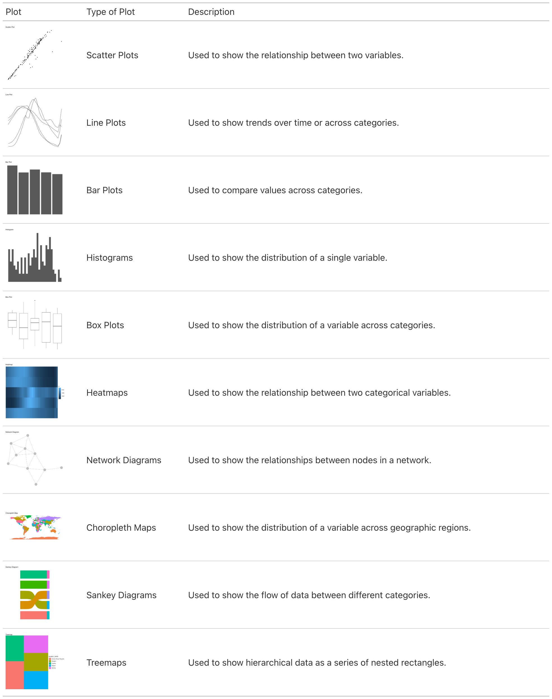

# Introduction to Data Visualization {#sec-09-data_visualization}

```{r}
#| echo: false
library(ggplot2)
book_theme <- theme_minimal() + 
  theme(plot.title=element_text(face="bold"))
ggplot2::theme_set(book_theme)
```

A powerful tool that allows the transformation of complex data sets into
comprehensible and insightful graphical representations, data
visualization is an important step of the data analysis called
**Exploratory Data Analysis (EDA)**. The information contained within
data highlights important patterns and trends, and uncover hidden
insights that might not be apparent from raw data alone. In the context
of health metrics and infectious diseases, data visualization plays a
critical role in tracking disease outbreaks, understanding health
trends, and communicating findings to policymakers and the public.

We have already seen how to create various types of plots using the
`{ggplot2}` package in R. In this chapter, we will discuss the history
and evolution of data visualization, delve deeper into the topic,
introducing the concept of the **Grammar of Graphics**, exploring
techniques for customizing plots, adding annotations, labels, and
themes, and creating interactive visualizations.

## History of Data Visualization

The history of data visualization spans centuries. The roots of data
visualization can be traced back to ancient times with rudimentary
visual representations, but its modern form began to take shape with the
growth of statistics and graphical methods in the 17th and 18th
centuries. One notable milestone was the publication of **William
Playfair**'s "Commercial and Political Atlas" in 1786, which introduced
innovative graphical techniques like the line graph, bar chart, and pie
chart.

Throughout the 19th and 20th centuries, pioneers such as **Florence
Nightingale** (1820-1910), **John Snow** (1813-1858), and **Jacques
Bertin** further advanced the field, using visualizations to communicate
complex data and uncover insights.

Data visualization was largely done manually or with the help of basic
plotting tools. One example are the hand-drown visualizations made by
**W.E.B. Du Bois** (1868-1963) in the early 20th century to illustrate
the social and economic conditions of African Americans in the United
States. These visualizations are now considered iconic examples of data
visualization and have been widely studied and digitally reproduced.

**The Digital Revolution**

The digital revolution of the late 20th century, with the advent of
powerful computing technologies, enabled the creation of interactive and
dynamic visualizations. Early programming languages like Fortran and
BASIC were used to create simple plots, then the development of
specialized software like SAS and SPSS provided more robust tools for
data analysis and visualization.

The emergence of the internet and web technologies in the 1990s led to
the introduction of more sophisticated statistical software and
programming environments. Tools like R, Python, and JavaScript, along
with libraries like `ggplot2`, `matplotlib`, and `D3.js`, revolutionized
the field of data visualization, making it more accessible and powerful.

In summary, data visualization plays a crucial role in fields like data
science, business analytics, scientific research, journalism, and public
policy. It serves as a potent tool for communicating data while
visualizing patterns, trends, and relationships that might not be
apparent from raw data alone. For instance, in public health, tracking
disease outbreaks in real time, such as with COVID19, tools like
dashboards and interactive maps are used extensively to monitor the
spread of the virus and communicating effectiveness of interventions.

## The Grammar of Graphics

One of the fundamental concepts in modern data visualization is the
**Grammar of Graphics**, which provides a structured approach to
creating visualizations layer by layer. This concept is clearly
interpreted in tools like the `{ggplot2}` R package, part of the
`{tidyverse}` ecosystem, developed by **Hadley Wickham** in 2005.

The Grammar of Graphics allows for the creation of complex
visualizations by combining simple building blocks such as **data**,
**aesthetics**, and **geoms** (geometric objects) in a structured
manner. It provides a flexible framework for customizing visualizations
and supports the creation of a wide range of plots, from basic scatter
plots to intricate multi-layered visualizations.

It starts with the `ggplot()` function, which initializes the plot. The function takes a data frame as its first argument and then additional arguments to specify the aesthetics of the plot, such as the x and y variables, color, shape, and size.

```{r}
#| eval: false
ggplot()
```

The aesthetics are defined using the `aes()` function, which maps variables in the data frame to visual properties of the plot, such as x and y coordinates, color, shape, and size. The `aes()` function is the mapping part of the plot, and it can be called with the `mapping` argument in the layers of the plot.

```{r}
#| eval: false
ggplot(data = df, 
       mapping = aes(x = x, y = y, color = z))
```

Data can also be called outside of the `ggplot()` function.
```{r}
#| eval: false
data %>%
   ggplot(aes(x = x, y = y, color = z))
```

And then additional layers are added using functions like `geom_point()` for a scatterplot, or `geom_line()` for a line plot, and so on. 
```{r}
#| eval: false
ggplot(data = df, aes(x = x, y = y, color = z))+
  geom_point()+
  ggtitle("Scatter Plot")
```

The `{ggplot2}` package provides a wide range of geoms, scales, and themes to customize the appearance of the plot. By combining these elements, you can create visually appealing and informative visualizations that effectively communicate your data. 

It allows the user to create complex visualizations by combining simple building blocks, with each layer of the plot allowing for an aesthetic mapping of data to visual properties, such as color, shape, and size, making it easy to create a wide range of visualizations, or even new data.
```{r}
#| eval: false
ggplot(data = df, aes(x = x, y = y, color = z))+
  geom_point()+
  geom_point(data = df2, aes(x = x2, y = y2, color = z2))+
  ggtitle("Scatter Plot")
```

In addition to functions provided by `{ggplot2}`, there are ggplot **extensions**, other functions and packages that can be used to create visualizations in R, such as `{plotly}`, `{ggplotly}`, `{leaflet}`, `{tmap}`, and `{shiny}`. These tools provide additional functionality for creating interactive plots, maps, and dashboards, allowing for more engaging and dynamic data visualizations.

## General Guidelines for Data Visualization

There are many types of plots that can be used to visualize different
types of data, such as cross tabulations for categorical variables,
scatter plots for continuous variables, side-by-side box plots, and
other summaries.

Here are some specifications about the usage of common types of plots:

```{r}
#| echo: false
#| eval: false
#| message: false
#| warning: false
library(tidyverse)
library(gridExtra)
library(gt)

# Sample data for plots
df <- hmsidwR::infectious_diseases %>%
  filter(year>=1990)%>%
  group_by(year,location_name)%>%
  reframe(x=mean(Deaths,na.rm=T), y= mean(DALYs,na.rm=T))

ggplot2::theme_set(ggplot2::theme_void())

# Scatter Plot
scatter_plot <- ggplot(df, aes(x, y)) + 
  geom_point() + 
  ggtitle("Scatter Plot")

# Line Plot
line_plot <- ggplot(df, aes(year, y,group=location_name)) + 
  geom_line() + 
  ggtitle("Line Plot")

# Bar Plot
bar_plot <- ggplot(df, 
                   aes(x = factor(location_name), y = y)) + 
  geom_col() + 
  ggtitle("Bar Plot")

# Histogram
histogram_plot <- df %>%
  ggplot(aes(x = y)) + 
  geom_histogram() + 
  ggtitle("Histogram")

# Box Plot
box_plot <- ggplot(df, 
                   aes(x = factor(location_name), y = y)) + 
  geom_boxplot() + 
  ggtitle("Box Plot")

# Heatmap (using geom_tile for illustration purposes)
heatmap_plot <- ggplot(df, 
                       aes(x = factor(year), y = factor(location_name), 
                           fill = y)) + 
  geom_tile() +
  ggtitle("Heatmap")

# Network graph
library(ggnet)
library(network)
library(sna)
net = rgraph(10, mode = "graph", tprob = 0.5)
net = network(net, directed = FALSE)
network_plot <-ggnet2(net)+ 
  ggtitle("Network Diagram")

# Choropleth Map 
map <- map_data("world")
choropleth_plot <- ggplot(map, 
                          aes(x = long, y = lat, group = group,
                              fill = region)) + 
  geom_polygon(show.legend = F) + 
  coord_sf()+
  ggtitle("Choropleth Map")

# Sankey Diagram 
library(ggsankey)
sankey_plot <- df %>% 
  group_by(location_name) %>%
  reframe(x=mean(x),y=mean(y)) %>%
  make_long(x,y) %>%
  ggplot(aes(x = x, 
               next_x = next_x, 
               node = node, 
               next_node = next_node,
               fill = factor(node))) +
  geom_sankey(show.legend = F) +
  ggtitle("Sankey Diagram")

# Treemap
library(treemapify)
treemap_plot <- df %>% 
  group_by(location_name) %>%
  reframe(x=mean(x),y=mean(y)) %>%
ggplot(aes(area = y, fill = location_name)) +
  geom_treemap()+
  ggtitle("Treemap")

# Save plots as images
ggsave("images/dataviz_gt_table/scatter_plot.png", scatter_plot)
ggsave("images/dataviz_gt_table/line_plot.png", line_plot)
ggsave("images/dataviz_gt_table/bar_plot.png", bar_plot)
ggsave("images/dataviz_gt_table/histogram_plot.png", histogram_plot)
ggsave("images/dataviz_gt_table/box_plot.png", box_plot)
ggsave("images/dataviz_gt_table/heatmap_plot.png", heatmap_plot)
ggsave("images/dataviz_gt_table/network_plot.png", network_plot)
ggsave("images/dataviz_gt_table/choropleth_plot.png", choropleth_plot)
ggsave("images/dataviz_gt_table/sankey_plot.png", sankey_plot)
ggsave("images/dataviz_gt_table/treemap_plot.png", treemap_plot)
```

```{r}
#| echo: false
#| eval: false
#| message: false
#| warning: false
library(gt)

# Data for the gt table
plot_data <- data.frame(
  plot = c("images/dataviz_gt_table/scatter_plot.png", 
           "images/dataviz_gt_table/line_plot.png", 
           "images/dataviz_gt_table/bar_plot.png", 
           "images/dataviz_gt_table/histogram_plot.png", 
           "images/dataviz_gt_table/box_plot.png", 
           "images/dataviz_gt_table/heatmap_plot.png", 
           "images/dataviz_gt_table/network_plot.png", 
           "images/dataviz_gt_table/choropleth_plot.png", 
           "images/dataviz_gt_table/sankey_plot.png", 
           "images/dataviz_gt_table/treemap_plot.png"),
  type_of_plot = c("Scatter Plots", "Line Plots", 
                   "Bar Plots", "Histograms", 
                   "Box Plots", "Heatmaps", 
                   "Network Diagrams", "Choropleth Maps", 
                   "Sankey Diagrams", "Treemaps"),
  description = c("Used to show the relationship between two variables.",
                  "Used to show trends over time or across categories.",
                  "Used to compare values across categories.",
                  "Used to show the distribution of a single variable.",
                  "Used to show the distribution of a variable across categories.",
                  "Used to show the relationship between two categorical variables.",
                  "Used to show the relationships between nodes in a network.",
                  "Used to show the distribution of a variable across geographic regions.",
                  "Used to show the flow of data between different categories.",
                  "Used to show hierarchical data as a series of nested rectangles.")
)

# Create the gt table
gt_table <- gt(plot_data) %>%
  text_transform(
    locations = cells_body(c(plot)),
    fn = function(x) {
      lapply(x, function(path) {
        local_image(filename = path, height = px(100))
      })
    }
  ) %>%
  cols_label(
    plot = "Plot",
    type_of_plot = "Type of Plot",
    description = "Description"
  ) %>%
  tab_options(
    table.width = pct(100)
  )

# Save the gt table as an image
gt::gtsave(gt_table, "images/09_gt_table.png")
```

{fig-align="center"}

## Example: Visualizing Lung Cancer Deaths by Age in Germany

This is an example of visualizing lung cancer deaths by age in Germany.
It is a line plot showing the number of deaths by age group. We have
already seen how to create a line plot using `{ggplot2}` in previous
chapters, the focus here is on customizing the plot to make it more
visually appealing and informative.

This is a basic output, and we will enhance it by customizing patterns,
colors, legend, and adjusting the layout. We will also explore how to
save the plot as an image file for sharing or publication.

```{r}
library(ggplot2)
library(ggpattern)

scatterplot <- hmsidwR::germany_lungc |>
  ggplot(aes(x = prevalence, y = dx)) +
  geom_point(aes(shape =sex)) + 
  labs(title = "Lung Cancer Deaths by Age in Germany",
       x = "Prevalence",
       y = "Deaths")

barplot <- hmsidwR::germany_lungc |>
  ggplot(aes(x = age, y = dx, group = sex))  +
  ggpattern::geom_col_pattern(aes(pattern=sex),
                              position="stack",
                              fill= 'white',
                              colour= 'black') +
  labs(title = "Lung Cancer Deaths by Age in Germany",
       x = "Age",
       y = "Deaths")

lineplot <- hmsidwR::germany_lungc |>
  ggplot(aes(x = age, y = dx, group = sex)) +
  geom_line(aes(linetype=sex)) +
  geom_point() +
  labs(
    title = "Lung Cancer Deaths by Age in Germany",
    x = "Age",
    y = "Deaths")
```

```{r}
#| layout-ncol: 3
#| label: fig-09-plot-layout
#| echo: false
scatterplot
barplot
lineplot
```

All of these three plots have a grammar of graphic structure, which
means that they are built using layers of data, aesthetics, and
geometric objects. The `ggplot()` function initializes the plot, and
then we add layers using `geom_point()`, `geom_line()`, and
`geom_col()`, (or `geom_col_pattern()` in this particular example), to
create the visualizations. We can further customize these plots by
adding titles, labels, and adjusting the appearance of the plot
elements.

### Colors and Patterns

Choosing the right colors for your visualizations is crucial. Colors can
highlight important aspects of your data and improve readability. Many
tools provide built-in color palettes, but you can also customize your
own. Here we just add the `scale_color_manual()` function to customize
the original plot, with a new color palette.

By typing `?scale_color_manual()` in the R console, you can access the
documentation and explore other options for customizing colors.

```{r}
#| eval: false
# Example: Customizing colors in a bar chart
lineplot +
  scale_color_manual(values = c("brown", "navy", "orange"))
```

In addition to colors, patterns can be used to differentiate between the groups in the plot. The `{ggpattern}` package provides a variety of patterns that can be used to fill the bars in a bar plot. Here we have used the `geom_col_pattern()` function to add patterns to the bars in the plot. An example is in @fig-09-plot-layout with the barplot. Another way is to use the `linetype` or `shape` aesthetics to differentiate between groups in a line plot or scatter plot.

### Theme, Legends and Guides

Legends and guides are essential for interpreting visualizations. They
help the audience understand what different colors, shapes, or sizes
represent in the plot. Here we have just changed the title of the
legend, but much more can be done, such as changing the position, and
labels. To change the position of the legend we can use the `theme()`
function as shown below.

In the R console, typing `?theme()` will provide more information on
customizing the appearance of your plots. In this case is useful to
adjust the angle of the text in the x-axis, and even this can be done
specifying the `angle` parameter in the `theme()` function.

The `guides()` function can be used to customize the legend, such as
reversing the order of the legend items.

```{r}
# Customising a legend to a plot
lineplot1 <- lineplot +
  labs(
    linetype = "Sex",
    subtitle = "Year 2019",
    caption = "DataSource: hmsidwR::germany_lungc"
  ) +
  guides(linetype = guide_legend(reverse = TRUE)) +
  theme(
    legend.position = "top",
    axis.text.x = element_text(angle = 45, hjust = 1),
    plot.title = element_text(hjust = 0.5, face = "bold")
  )

lineplot2 <- lineplot1 + 
  scale_y_log10() + 
  coord_cartesian(clip = "off") +
  annotate("text", x = Inf, y=Inf, 
           hjust = 1, vjust = 0,
           label = "Log Scale")
```

### Plot Layouts

The layout of your plots can significantly impact their effectiveness.
Arranging multiple plots in a grid can help compare different aspects of
your data side-by-side. We can use the `grid.arrange()` function from
the `gridExtra` package to arrange multiple plots in a grid layout. Or,
we can use the `layout()` function to specify the layout of the plots.
There are other packages that can be used such as `patchwork` and
`cowplot`, which provide additional functionalities for arranging plots.

```{r}
#| eval: false
# Example: Arranging multiple plots
library(gridExtra)

grid.arrange(p, p1, p2, ncol = 3)
```

```{r}
#| echo: false
#| layout-ncol: 3
lineplot
lineplot1
lineplot2
```

### Saving as an Image

Once you've created your visualization, you might want to save it as an
image file for sharing or publication.

```{r}
#| eval: false
ggsave("lineplot.png", plot = p2, width = 6, height = 4)
```

## Practicing Data Visualization

To practice making data visualizations, there are numerous free
resources available that provide valuable information and opportunities
to enhance your skills. By engaging with these platforms, you can
practice your abilities, share your final results, and receive feedback
from the community. While the feedback may sometimes be critical, it is
an essential part of the learning process and will help you improve if
you stay persistent.

Participating in competitions and challenges such as **#TidyTuesday**,
**#30DayChartChallenge**, and **#30DayMapChallenge** offers a great way
to refine your skills. These competitions encourage you to create and
share visualizations on various themes, pushing you to experiment with
different techniques and styles. By consistently participating in these
challenges and actively seeking feedback, you will steadily enhance your
proficiency. Over time, you will find yourself becoming more adept and
confident in your data visualization skills.
