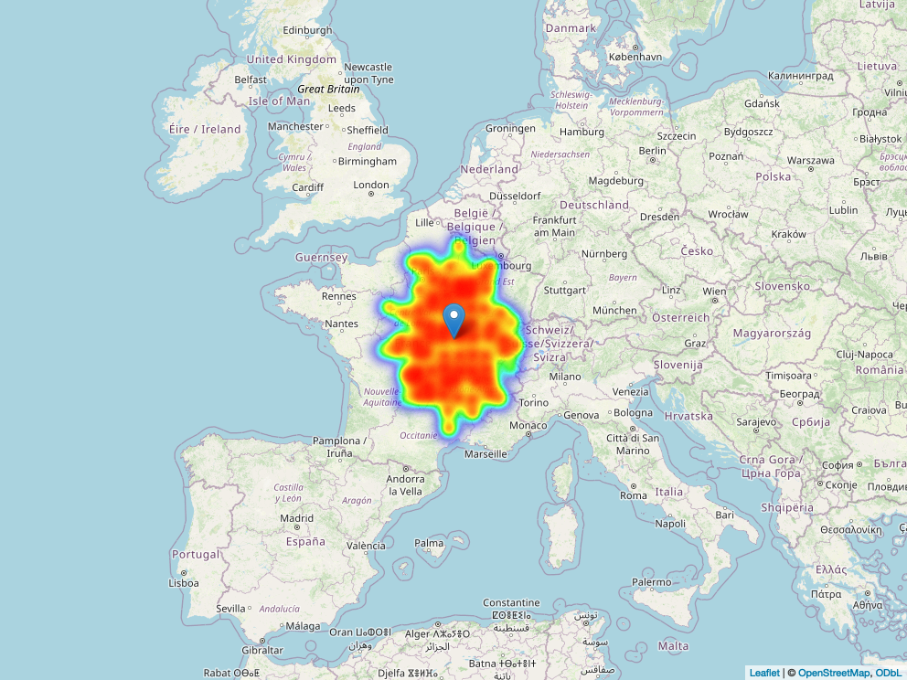

# Spatial Data Modelling and Visualization {#sec-11-spatials}

```{r}
#| echo: false
ggplot2::theme_set(ggplot2::theme_minimal())
```

::: solutionbox
::: solutionbox-header
::: solutionbox-icon
:::

Learning Objectives
:::

::: solutionbox-body
-   How to make a map
-   Identify the missing pieces
-   Map the results
:::
:::

This chapter is dedicated to spatial modelling and visualization.

## Locate infections with Montecarlo simulations

In this example we use synthetic data made with a classic technique of a
for-loop. We build a four vector data-frame with longitude, latitude,
number of people between infected and non infected in a population.

```{r}
#| message: false
#| warning: false
library(tidyverse)
```

```{r}
# creating empty dataframe template
df <- as.data.frame(matrix(nrow = 1000, ncol = 4))
# naming dataframe headers
colnames(df) <- c(
  "longitude",
  "latitude",
  "number",
  "type"
)
# First 500 entries are non infected, the other 500 entries are infected
for (i in 1:1000) {
  if (i > 500) {
    df$type[i] <- "infected"
  } else {
    df$type[i] <- "non_infected"
  }
  # coordinates
  df$latitude[i] <- rnorm(
    n = 1,
    mean = 46.8705,
    sd = 1
  )[1]
  df$longitude[i] <- rnorm(
    n = 1,
    mean = 3.834,
    sd = 1
  )[1]
  # infections
  df$number[i] <- rnorm(
    n = 1,
    mean = 100,
    sd = 25
  )[1]
}
```

```{r}
df %>%
  head()
```

```{r}
df %>%
  summary()
```

### The epicenter of infection

Calculate the coordinates of the center of mass for the infections, even
called **epicenter** of the infections.

```{r}
center_of_mass <- function(df) {
  longitude <- sum(df$number * df$longitude) / sum(df$number)
  latitude <- sum(df$number * df$latitude) / sum(df$number)
  return(c(as.numeric(longitude), as.numeric(latitude)))
}
```

```{r}
# coordinates of the center of mass
com <- center_of_mass(df)
com <- as.double(com)
com
```

```{r}
df_com <- tibble(
  longitude = com[1],
  latitude = com[2],
  number = 200,
  type = "CoM"
)
df_com
```

### Mapping infections

There are various ways to map infections, here we'll see three type of
maps made with `{ggplot2}`, `{ggmap}`, and `{leaflet}`.

Also for specific location we can use the `{worldmet}` package.

#### Map with ggplot2

```{r}
ggplot() +
  geom_point(
    data = df,
    mapping = aes(
      x = longitude,
      y = latitude,
      color = type,
      size = number
    ),
    alpha = 0.1
  ) +
  geom_point(
    data = df_com,
    mapping = aes(
      x = longitude,
      y = latitude,
      size = number
    ), color = "black"
  ) +
  scale_color_manual(values = c(
    "infected" = "#a60845",
    "non_infected" = "grey20"
  )) +
  xlab("Longitude") +
  ylab("Latitude") +
  ggtitle("Center of mass") +
  labs(
    color = "Type",
    size = "Magnitude of Infection"
  ) +
  theme_minimal()
```

#### Map with ggmap

```{r}
#| eval: false
#| message: false
#| warning: false
library(ggmap)
bbox <- c(
  left = -1.099,
  bottom = 44.559,
  right = 8.767,
  top = 49.182
)

mapObj <- get_stadiamap(bbox,
  maptype = "stamen_terrain",
  zoom = 6
)

mapatt <- attributes(mapObj)
mapObj <- matrix(adjustcolor(mapObj, alpha.f = 0.2),
  nrow = nrow(mapObj)
)
attributes(mapObj) <- mapatt
mapObj <- ggmap(mapObj)
mapObj <- mapObj +
  geom_point(data = df, mapping = aes(
    x = longitude,
    y = latitude,
    color = type,
    size = number
  ), alpha = 0.05) +
  geom_point(
    data = df_com,
    mapping = aes(
      x = longitude,
      y = latitude,
      size = number
    ), color = "black"
  ) +
  scale_color_manual(values = c(
    "infected" = "#a60845",
    "non_infected" = "grey20"
  )) +
  xlab("Longitude") +
  ylab("Latitude") +
  ggtitle("Center of mass") +
  labs(
    color = "Type",
    size = "Magnitude of Infection"
  )
mapObj
```

#### Map with leaflet

Import `{leaflet}` and `{leaflet.extras}` to make a heatmap:

```{r}
library(leaflet)
library(leaflet.extras)
# define center of map
lat_center <- com[2]
long_center <- com[1]
# creating intensity heat map
heatmap <- df %>%
  leaflet() %>%
  addTiles() %>%
  setView(long_center, lat_center, 4.5) %>%
  addHeatmap(
    lng = ~longitude, lat = ~latitude,
    intensity = ~number,
    max = 100, radius = 13, blur = 20
  ) %>%
  # parameter to set
  addMarkers(lng = as.numeric(com[1]), lat = as.numeric(com[2]))
```

```{r}
#| eval: false
# webshot::install_phantomjs()
mapview::mapshot(heatmap, file = "images/heatmap.png")
```

<center></center>

### The Euclidean distance

In infectious disease modelling is very helpful to understand how
infections spread through populations for making strategic plans for
disease control and prevention. The Euclidean distance serves as a
fundamental tool in spatial epidemiology, it represents the shortest
distance between two points in a plane.

It is calculated as the square root of the sum of the squares of the
differences between corresponding coordinates of the two points.

The Euclidean distance formula:

$$\text{Euclidean Distance} = \sqrt{(x_2 - x_1)^2 + (y_2 - y_1)^2}$$

Where: - $(x_1, y_1)$ are the coordinates (e.g., latitude and longitude)
of the first point (e.g., infected individual). - $(x_2, y_2)$ are the
coordinates of the second point (e.g., susceptible individual or
location).

It calculates the straight-line distance between two points in a
two-dimensional space, which can be applied to model the spatial spread
of infectious diseases based on the proximity of individuals or
locations.

```{r}
#| message: false
#| warning: false
#| echo: false
#| fig-width: 4
#| fig-height: 2
#| fig-align: center
#| fig-cap: "Euclidean Distance representation"

library(ggdag)
dagify(y ~ x,
  exposure = "x",
  outcome = "y",
  coords = time_ordered_coords()
) %>%
  ggdag() + theme_dag_blank()
```

To calculate the Euclidean distance we make a function that considers
the distance between the center of mass and the infection coordinates.

```{r}
# helper function for calculating euclidean distance metric
euclidean_distance <- function(longitude, latitude, long_com, lat_com) {
  long_distances <- (longitude - long_com[1])^2
  lat_distances <- (latitude - lat_com[1])^2
  return((long_distances + lat_distances) * 0.5)
}
```

The Euclidean distance is used to estimate the likelihood of
transmission between individuals based on their spatial proximity.
Individuals within a certain distance of an infected individual may have
a higher risk of contracting the infection compared to those farther
away.

### Cost and Loss functions

The simulation of the spread of infectious diseases requires the
calculation of a **loss function**, which serves as a crucial tool for
quantifying the negative consequences associated with the spread of the
disease. Specifically, the loss function helps delineate the
**threshold** beyond which adverse outcomes occur, and essentially
assigns a value to different distances, reflecting the **severity** of
the consequences when individuals are within certain proximity to each
other. For instance, when the Euclidean distance exceeds a predefined
threshold, denoting that susceptible individuals are dangerously close
to infected ones, the loss function assigns a higher loss value.
Conversely, when individuals are at a safe distance from each other, the
loss value may be minimal or even zero.

By incorporating the Euclidean distance into the loss function, we can
effectively model the spatial dynamics of disease transmission and
assess the associated risks. This approach enables us to identify
critical zones where the likelihood of disease spread is elevated,
guiding public health interventions and mitigating potential outbreaks.

For example, if the threshold is set to a certain distance (e.g., 5
meters), and the Euclidean distance between an infected individual and a
susceptible individual exceeds this threshold (e.g., 6 meters), it
indicates that the susceptible individual is too close to the infected
individual and is at risk of contracting the disease. This situation
would **trigger a loss** according to the loss function.

The threshold value is crucial as it determines the sensitivity of the
loss function to the distance between infected and susceptible
individuals. A lower threshold implies that even relatively small
distances can lead to losses, while a higher threshold indicates that
losses occur only when individuals are in closer proximity to each
other. The choice of threshold depends on various factors such as the
**infectiousness of the disease**, the **mode of transmission**, and the
desired **level of risk tolerance**. Adjusting the threshold allows for
fine-tuning the model to better capture the dynamics of disease spread
and its impact on the population, and this is something that is related
to model calibration in machine learning.

A simple example would be considering:

-   Euclidean distance between infected and susceptible individuals

-   Threshold distance beyond which loss occurs

```{r}
distance <- 5
threshold <- 3
```

#### Define the loss function

```{r}
loss_function <- function(distance, threshold) {
  if (distance <= threshold) {
    # No loss if distance is within threshold
    return(0)
  } else {
    # Loss increases linearly with distance beyond threshold
    return(distance - threshold)
  }
}
```

```{r}
loss <- loss_function(distance, threshold)
loss
```

```{r}
# cost calculation function
cost_function <- function(df) {
  long_com <- df$longitude[nrow(df)]
  lat_com <- df$latitude[nrow(df)]
  euclideans <- euclidean_distance(
    df$latitude[-nrow(df)],
    df$latitude[-nrow(df)],
    long_com, lat_com
  )
  # implementation of the cost function
  costs <- euclideans * df$number[-nrow(df)]
  return(sum(costs))
}
```

```{r}
cost_function(df) / 1000000
```

Applying Monte Carlo simulation to assess the cost and loss associated
with the spread of infections. In the context of infectious diseases,
data on transmission rates, infection severity, and other factors are
subject to volatility, seasonality, and uncertainty. Monte Carlo
simulation, a widely-used technique in epidemiological analysis, is an
appropriate method for assessing the risks associated with the spread of
infections. In this case, there is a risk involved in selecting
strategies to mitigate the spread of infections, such as implementing
public health measures or vaccination campaigns.

-   How sensitive are the costs and losses incurred if we choose a
    specific intervention strategy?
-   How much higher could the costs and losses be, compared to the
    baseline scenario?

I can apply Monte Carlo simulation by repeating the experiment,
modelling the distribution of transmission rates and infection outcomes.
I will repeat the scenario of infection spread (i.e., the distribution
of transmission rates and infection outcomes) 1,000 times. For each run,
I will calculate the resulting costs and losses associated with the
spread of infections, and I will store the results of each run in a
results dataframe.

```{r}
# dataframe for storing Monte-carlo simulation results
results <- as.data.frame(matrix(nrow = 10000, ncol = 2))
colnames(results) <- c("iteration", "costs")
```

Execute 10,000 iterations of the Monte-carlo simulation to assess cost
uncertainty / cost sensitivity.

```{r}
for (i in 1:10000) {
  df$number[-1001] <- rnorm(
    n = 1000,
    mean = 100,
    sd = 25
  )
  results$iteration[i] <- i
  results$costs[i] <- cost_function(df) / 1000000
}
```

Plot results of Monte-carlo simulation in the form of a histogram:

```{r}
ggplot() +
  geom_histogram(
    data = results,
    mapping = aes(x = costs),
    fill = alpha("#a60845", alpha = 0.5),
    bins = 25
  ) +
  labs(
    title = "Simulated infection sensitivity",
    subtitle = "at center of gravity (center of mass)"
  ) +
  xlab("Simulated loss") +
  ylab("Absolute frequency")
```
