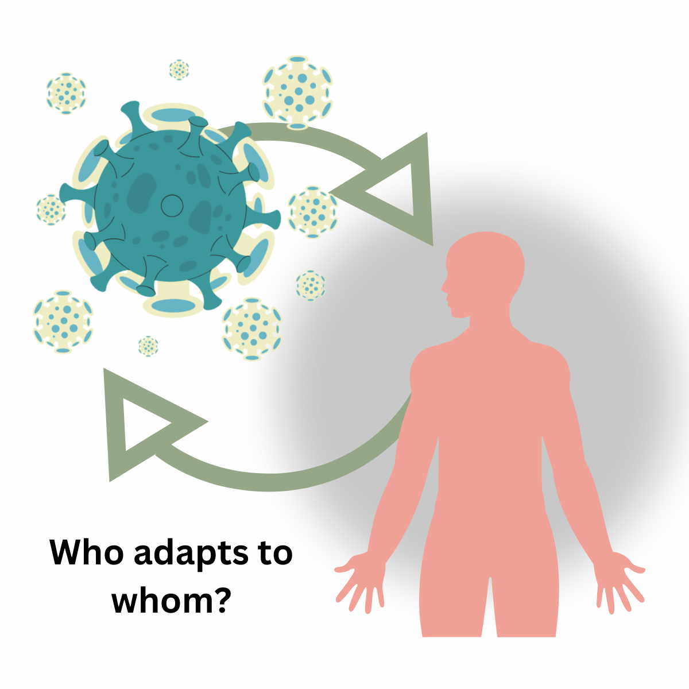

# Introduction to Infectious Diseases {#sec-13-infectious_diseases}

:::::: solutionbox
:::: solutionbox-header
::: solutionbox-icon
:::

Learning Objectives
::::

::: solutionbox-body
-   Learn about the dynamics of infectious diseases and their impact on
    human health
-   Understand the role of mathematical models in predicting infectious
    disease outbreaks
-   Explore the components of infectious disease models and their
    implications
:::
::::::

\

> **"Several infectious diseases are emerging and threatening human
> health worldwide. The burden of infectious diseases is undeniably a
> global issue, causing millions of deaths annually."[@santangelo2023]**

The advent of machine learning (ML) has revolutionised the field of
**infectious disease research**\index{infectious disease} by providing
robust tools for predicting outbreaks and understanding the dynamics of
spread. In this chapter, we will enhance our understanding of these
diseases and look at the effects on Disability-Adjusted Life Years
(DALYs) by applying **machine learning** and **data visualisation**
techniques learned in previous chapters (@sec-05-machine_learning and
@sec-09-data_visualisation). To further improve the knowledge of the
impact of infectious diseases on global health, we will explore how
integrating ML models can improve the accuracy of disease burden
estimations and provide valuable insights into the impact of infectious
diseases on public health.

## Infectious Diseases the Invisible Enemies

Emerging infectious diseases are a global concern, causing millions of
deaths annually. Understanding their behaviour and predicting outbreaks
is fundamental not only for public health but also for advancing
prediction techniques that can be applied in other fields.

**Microorganisms**, including **bacteria** and **viruses**, adapt and
evolve at a rate much faster than humans. For example, the generation
time for bacteria can be as short as 20–30 minutes, while viruses can
replicate in even shorter time frames. This rapid adaptation allows
**pathogens** to evolve quickly, developing resistance to treatments and
evading the **host**'s immune system.

Infectious diseases follow a multi-stage progression that begins when
the infective agent, whether **viral**, **bacterial**, or **parasitic**,
begins to thrive and multiply throughout the body[@broemeling2021] and
the process of infection starts. The rate at which the pathogen
proliferates varies significantly depending on the type of organism
involved. Each infectious disease has a unique **incubation period**,
which is the interval between the initial establishment of the pathogen
in the host and the onset of symptoms.

The incubation period can range from a few hours to several months,
influenced by factors such as the pathogen's growth rate, the host's
immune response, and the route of transmission. For example, the
incubation period for the **influenza virus** is typically 1 to 4 days,
whereas for diseases like **hepatitis B**, it can be as long as 6
months. Understanding the incubation period helps in identifying the
time frame for potential exposure.

Several factors influence an individual’s susceptibility to infection,
including:

-   Infection dose (quantity of invading germs)
-   Virulence (the ability of the organism to cause disease)
-   Immune status (the condition of the body's immune system)
-   Transmission route (contact with the source of infection for
    contagious diseases)

{#fig-adapt_virus
fig-align="center" fig-alt="Who adapts to whom? - (AI generated image)"
width="347"}

**Viruses**\index{virus}, word derived from the Latin word for
**"poisonous substance"**, are intracellular parasites that can only
replicate within living host cells. Their sizes range from 20 to 400 nm
in diameter and can only be observed with an electron microscope.
Outside of a living cell, a virus is a dormant particle of various
shapes. Once inside a cell, it replicates, often killing the cell or
altering its functions.

The following seven diseases are all caused by an infectious agent such
as virus or bacteria, generally cause acute symptoms, ranging from mild
to severe, and require prompt medical attention to prevent complications
and further spread:

1.  [Acute Respiratory Infection
    (ARI)](https://www.ncbi.nlm.nih.gov/books/NBK11786/)
2.  [Covid-19](https://en.wikipedia.org/wiki/COVID-19)
3.  [Dengue](https://en.wikipedia.org/wiki/Dengue_fever)
4.  [Influenza/Influenza-Like Illness
    (ILI)](https://en.wikipedia.org/wiki/Influenza)
5.  [Malaria](https://en.wikipedia.org/wiki/Malaria)
6.  [West Nile Virus](https://en.wikipedia.org/wiki/West_Nile_virus)
7.  [Zika](https://en.wikipedia.org/wiki/Zika_fever)

These diseases are transmitted through various means and can be grouped
by **transmission methods**:

-   **Vector-Borne**: Dengue, Malaria, West Nile Virus, and Zika are
    primarily spread through mosquito bites.
-   **Respiratory Droplets**: ARI, COVID-19, and Influenza/ILI are
    transmitted via respiratory droplets when infected individuals cough
    or sneeze.

## Mathematical Models for Infectious Diseases

The application of mathematical models to infectious diseases dates back
over a century, with significant contributions from pioneers such as
*Kermack* and *McKendrick*, who established the foundations of the
subject[@keeling2009]. Their work introduced the concept of categorising
individuals based on their epidemiological status: **susceptible**,
**infected**, and **recovered**.

### The SIR Model

One of the simplest and most fundamental epidemiological models, the
**SIR model**\index{SIR}, to which we had a quick look in the previous
chapters (@sec-05-machine_learning and @sec-06-techniques), is based on
these three compartments and uses a system of differential equations to
describe how individuals move between these compartments based on
**infection rate** and the **recovery rate**. These parameters help
predict the epidemic’s progression, showing how the number of
susceptible individuals decreases as the number of infected individuals
increases, eventually leading to recovery and a decline in new
infections, as shown in @eq-sir-model-theory.

More complex models, includes:

-   **SEIR Model**: This model introduces an exposed (E) compartment,
    which represents individuals who have been infected but are not yet
    infectious. This compartmentalization is particularly useful for
    diseases with significant incubation periods (e.g., COVID-19).
    Practical applications are in @sec-05-epidemic-x and
    @sec-14-modelling-covid19 .
-   **SIS Model**: In this model, individuals who recover from infection
    do not gain lasting immunity, meaning they return to the susceptible
    class and can become reinfected.
-   **MSIR Model**: In some diseases, such as measles, maternal
    antibodies provide temporary immunity to newborns. The M (maternal
    immunity) compartment is used in such cases.

## Components of Infectious Disease Models

1.  **Infection Rate**: This parameter, often denoted as $\beta$ (beta),
    controls how quickly the susceptible population becomes infected. It
    depends on factors such as contact rate and the probability of
    transmission per contact. It is the rate at which individuals move
    from the susceptible compartment to the infected compartment. The
    infection rate is proportional to the product of susceptible and
    infected individuals[@kolokolnikov2020].

$$
\beta = \text{Contact Rate} \times \text{Probability of Transmission per Contact}
$$ {#eq-infection-rate}

2.  **Recovery Rate**: Denoted by $\gamma$ (gamma), this defines the
    rate at which infected individuals recover and either gain immunity
    or become susceptible again (depending on the model). The average
    duration of infection is the reciprocal of the recovery rate.

$$
\gamma = \frac{1}{\text{Average Duration of Infection}}
$$ {#eq-recovery-rate}

3.  **Incubation Period**: In models like SEIR, the incubation period is
    the average time that exposed individuals take before they become
    infectious. This is a critical factor in diseases like COVID-19 and
    Ebola. The incubation period is the reciprocal of the rate at which
    individuals move from the exposed compartment to the infected
    compartment. $\sigma$ is the rate at which individuals move from the
    exposed compartment to the infected compartment.

$$
\text{Incubation Period} = \frac{1}{\sigma}
$$ {#eq-incubation-period}

4.  **Transmission Rate**: The transmission rate often depends on how a
    disease spreads—whether it’s through respiratory droplets, direct
    contact, vectors like mosquitoes, or other means. Transmission rates
    are also influenced by human behaviours, such as hygiene practices
    and social distancing measures. The transmission rate is the product
    of the probability of transmission per contact and the number of
    contacts. $\beta$ is the probability of transmission per contact,
    and the number of contacts is the average number of people an
    infected individual comes into contact with.

$$
\text{Transmission Rate} = \beta \times \text{Number of Contacts}
$$ {#eq-transmission-rate}

5.  **Reproduction Ratio (**$R_0$): A key metric that indicates the
    **average number of secondary cases generated by one infectious
    individual in a fully susceptible population** is the **basic
    reproduction ratio (**$R_0$). This value is calculated using the
    formula in @eq-r0. $\beta$ is the transmission rate and $\gamma$ is
    the recovery rate. As the ratio of the transmission rate to the
    recovery rate, $R_0$ provides a measure of the disease's ability to
    spread.

$$
R_0 = \frac{\beta}{\gamma}
$$ {#eq-r0}

In summary, the SIR model is a simple yet powerful tool for
understanding the dynamics of infectious diseases. By tracking the
movement of individuals between susceptible, infected, and recovered
compartments, the model can predict the course of an epidemic and help
public health officials make informed decisions about disease control
measures. The value of $R_0$ determines the epidemic **threshold**:

$$
\text{If } R_0 \left\{\begin{matrix}
 \begin{aligned}
 >1 = &  \text{ Epidemic}\\
 <1 = & \text{ End of Infection Transmission}
 \end{aligned}
\end{matrix}\right. 
$$ {#eq-r0-threshold}

To accounts for changes in the population's immunity, the **effective
reproduction number (**$R_{eff}$) is calculated on a susceptible
population which is not completely susceptible, and value of $R_{eff}$
results less than $R0$ due to the presence of immune individuals in the
population.

Another critical concept in infectious disease is the **herd immunity**,
which refers to the indirect protection from infectious diseases that
occurs when a large percentage of a population becomes immune to the
infection, either through vaccination or previous infections. The herd
immunity is reached when the effective reproduction number is less than
1, and the disease stops spreading.

The SIR model shows the dynamics of an epidemic by looking at how it
grows and eventually declines. Initially, the number of cases rises
exponentially, leading to a peak, but as the susceptible population
start reducing in number due to various factors, the growth rate slows
with subsequent decline.

## Advancements and Extensions

Mathematical modelling has evolved to include more complex factors such
as age structure, stochasticity, and spatial dynamics. Age-structured
models, for example, consider how different age groups interact and
contribute to the spread of diseases, which is particularly important
for diseases like measles or COVID-19. Stochastic models account for
random events that can influence the course of an epidemic, such as the
introduction of the disease into a new population.

The use of machine learning algorithms such as **decision trees**,
**random forests**, **support vector machines**, and **deep-learning
networks** such as **Long short-term memory (LSTM)**\index{LSTM} models,
effectively improve the identification of patterns and trends that may
not be obvious with mechanistic models. These models are able to improve
prediction accuracy working smoothly with large datasets.

Combining models and data sources enhances prediction accuracy, various
models and techniques can be applied to reduce bias and the risk of
overfitting. For instance, **ensemble
learning**\index{ensemble learning} combines the predictions of multiple
models to improve accuracy. In this context, we will explore how machine
learning can predict infectious disease outbreaks and their impacts on
human health, ultimately aiming to reduce the burden of disease.

Another significant aspect to consider is the emerging use of **transfer
learning**\index{transfer learning}, which involves applying knowledge
gained from one predictive task to another. This approach is especially
useful when data is limited and models need to be adapted. Although
relatively under-explored in infectious disease research, transfer
learning holds significant promise for improving predictions in areas
with scarce data. By leveraging information from related tasks, this
technique can enhance model performance, leading to more accurate and
reliable predictions in public health scenarios [@roster2022].

## The Impact on DALYs

To understand the magnitude of infectious diseases impacts on
DALYs\index{DALY}, we can simply consider the DALYs rate of change. The
percentage change in total DALYs and DALYs due to infectious diseases,
in general or for a specific infective virus such as COVID19, allows us
to assess the impact on the overall burden of disease. In the case of
COVID19 for example, the percentage change in DALYs due to COVID19 can
explain how this virus affected global health and produced excess
mortality and morbidity.

$$
\text{Percent change in DALYs} = \frac{\text{DALYs due to Infectious Diseases}}{\text{Total DALYs}} \times 100
$$ {#eq-daly-change}

Where the $DALYs = \sum_{i=1}^{n}{(YLD_i + YLL_i)}$, $YLD$ and $YLL$ are
the years lived with disability and the years of life lost respectively.

This percentage change provides a measure of the impact of infectious
diseases on the overall burden of disease. The DALYs due to infectious
diseases can be calculated as the sum of the DALYs for each disease, and
the total DALYs can be calculated as the sum of the DALYs for all
diseases. The percentage change in DALYs due to infectious diseases can
then be calculated as the ratio of the DALYs due to infectious diseases
to the total DALYs, multiplied by 100.

Furthermore, the use of machine learning models used to predict the
variation of number of DALYs due to infectious diseases over time can be
a valuable tool to understand the impact of infectious diseases on
global health. Two approaches can be valued:

1.  DALYs as a function of the **socio-demographic index
    (SDI)**\index{SDI}: A composite index of the average income per
    person, educational attainment, and total fertility rate. The model
    function can be expressed as: $$
    DALY_{id}= f(SDI)+\epsilon
    $$ {#eq-daly-sdi} where is the number of $DALYs$ is the response
    variable, $SDI$ the socio-demographic index acting as predictor,
    $f(.)$ is the function that relates the number of DALYs to the
    socio-demographic index, and $\epsilon$ is the error term.

2.  DALYs as a function of the **human development index
    (HDI)**\index{HDI}: A composite index of life expectancy, education,
    and per capita income indicators. The model function can be
    expressed as: $$
    DALY_{id}= f(HDI)+\epsilon
    $$ {#eq-daly-hdi} where is the number of $DALYs$ is the response
    variable, $HDI$ the human development index where is the number of
    $DALYs$ is the response variable, $HDI$ the socio-demographic index
    acting as predictor, $f(.)$ is the function that relates the number
    of DALYs to the socio-demographic index, and $\epsilon$ is the error
    term. Big data analytics with machine learning analysis are used to
    classify the patterns of global disease burden by human development
    index (HDI) to have a better understanding of DALYs caused by
    infectious diseases such as COVID19 given different levels of HDI.

This can help us to understand the trends and patterns of infectious
diseases and their impact on global health.
