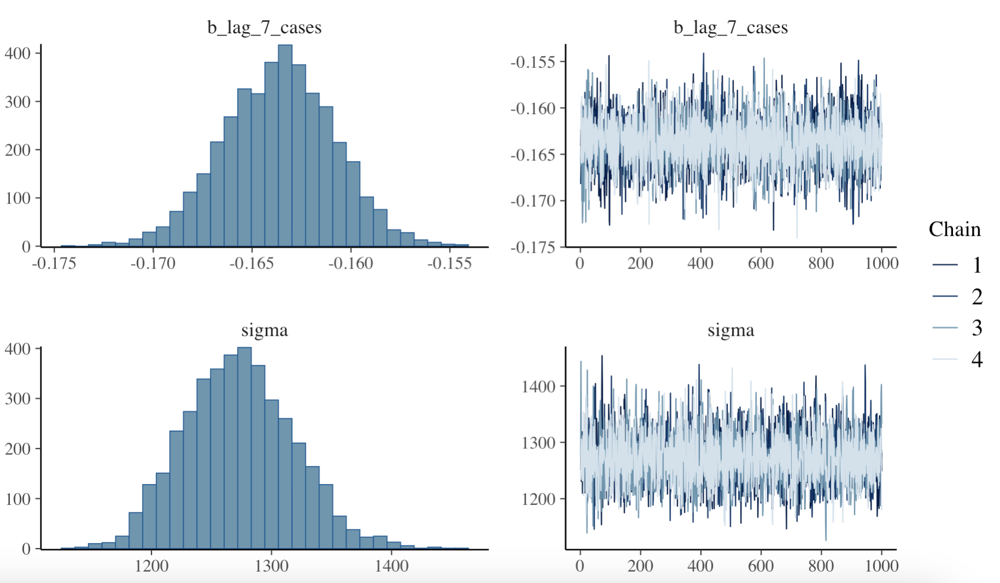

# Covid19 Outbreaks {#sec-14-covid19}

```{r}
#| echo: false
library(tidyverse)
ggplot2::theme_set(ggplot2::theme_minimal())
```

::: solutionbox
::: solutionbox-header
::: solutionbox-icon
:::

Learning Objectives
:::

::: solutionbox-body
-   What is Covid19
-   How does it spread
-   Map Covid19 outbreaks
:::
:::

## Coronavirus Disease 2019 (Covid19)

COVID-19\index{covid19}, short for "Coronavirus Disease 2019," is an
infectious disease caused by the novel coronavirus SARS-CoV-2. It was
first identified in December 2019 in the city of Wuhan, Hubei province,
China. The World Health Organization (WHO)\index{WHO} declared the
outbreak a Public Health Emergency of International Concern on January
30, 2020, and later a pandemic\index{pandemic} on March 11, 2020.

COVID-19 is a respiratory illness characterized by symptoms such as
fever, cough, and shortness of breath, and can range from mild to
severe, with some cases resulting in death. The pandemic has led to
widespread healthcare challenges, economic disruptions, and significant
changes to daily life, including social distancing measures, lockdowns,
and travel restrictions.

COVID-19, caused by the SARS-CoV-2 virus, has resulted in multiple
outbreaks since it was first identified. The World Health Organization
(WHO) has tracked and reported on these outbreaks, noting significant
waves of infections globally. As of May 2024, there have been over 775
million confirmed cases and more than seven million deaths worldwide.
The pandemic has seen varying intensities of outbreaks across different
regions, influenced by factors such as virus variants, public health
responses, and vaccination rates.

Countries around the world implemented various levels of stringent
measure implemented by authorities to restrict movement and activities
in a specific area to control the spread called **lockdowns**.

In particular, several countries implemented diversified level of
lockdowns to control the spread of COVID-19, including:

-   **China**: The initial epicenter in Wuhan experienced strict
    lockdowns, with entire cities quarantined and movement heavily
    restricted. These measures were effective in curbing the initial
    spread of the virus.
-   **Italy**: One of the first European countries severely impacted,
    Italy imposed nationwide lockdowns in March 2020, closing schools,
    businesses, and restricting travel.
-   **United States**: Lockdown measures varied by state, with
    significant restrictions in place during the early waves of the
    pandemic. These included stay-at-home orders, business closures, and
    mask mandates.
-   **India**: Implemented one of the world's largest lockdowns in March
    2020, affecting millions of people and including strict travel bans
    and business closures.
-   **Australia**: Used localized lockdowns effectively, particularly in
    cities like Melbourne, which saw extended periods of strict
    restrictions.
-   **United Kingdom**: Imposed several lockdowns, including a strict
    nationwide lockdown in early 2021, along with tiered restrictions
    based on regional infection rates.

## The spread of COVID-19

COVID-19 is primarily spread through respiratory droplets produced when
an infected person coughs, sneezes, or talks. The virus can also spread
by touching surfaces contaminated with the virus and then touching the
face. The incubation period for COVID-19 is typically 2-14 days, during
which an infected person may be asymptomatic but still contagious.

To prevent the spread of COVID-19, public health measures such as:

-   **Diagnostic tests**: such as PCR (polymerase chain reaction) tests
    and rapid antigen tests are used to detect active infections.
    Antibody tests determine past infections.
-   **Treatment**: While there is no specific antiviral treatment for
    COVID-19, supportive care, including oxygen therapy and mechanical
    ventilation, is used for severe cases. Some antiviral medications
    and therapies have been repurposed or developed specifically for
    COVID-19.
-   **Vaccination**\index{vaccination}: Vaccines have been developed and
    distributed globally to prevent COVID-19. These vaccines, including
    mRNA vaccines (Pfizer-BioNTech and Moderna), viral vector vaccines
    (AstraZeneca and Johnson & Johnson), and inactivated virus vaccines
    (Sinovac and Sinopharm), have shown high efficacy in preventing
    severe disease and reducing transmission.

COVID-19 has had a profound impact on global health, economies, and
daily life. Efforts to combat the pandemic have involved unprecedented
levels of international cooperation, scientific research, and public
health initiatives. Ongoing vaccination campaigns and adherence to
public health guidelines are critical in controlling the spread of the
virus and preventing further outbreaks. Concerns specific to COVID-19
vaccines by the anti-vaccine movement have also been a significant
challenge in achieving widespread vaccination coverage. Despite the
development of effective vaccines, the speed of their development, and
potential long-term effects led to vaccine hesitancy and resistance in
some populations. Achieving global vaccination coverage remains a
significant challenge.

## Mapping Covid19 outbreaks

Mapping COVID-19 outbreaks can help identify hotspots of infection,
track the spread of the virus, and inform public health interventions.
Geographic Information Systems (GIS) and spatial analysis techniques can
be used to visualize and analyze COVID-19 data, such as the number of
cases, deaths, and recoveries, at the local, regional, and global
levels.

## Example: modelling the spread of COVID-19

Spatiotemporal modelling of COVID-19 outbreaks[@niraula2022] can provide
valuable insights into the dynamics of the pandemic and help guide
public health responses. In this example, we'll use R to model the
spread of COVID-19 using a Susceptible-Infected-Recovered (SIR) model, a
common compartmental model used in epidemiology to simulate the spread
of infectious diseases. A Bayesian machine learning approach is used to
predict the spread of the virus over time and across different regions.
Bayesian methods have the advantages of handling uncertainties and allow
for accounting of prior information into the model.

First, we'll load the necessary packages and define some parameters for
our model. We can use the Susceptible-Infected-Recovered (SIR) model to
describe the spread of the disease, where S represents the number of
susceptible individuals, I represents the number of infected
individuals, and R represents the number of recovered individuals. The
model structure can be described as follows:

$$dS/dt = -beta * S * I / N$$ $$dI/dt = beta * S * I / N - gamma * I$$
$$dR/dt = gamma * I$$

where beta is the rate of transmission, gamma is the rate of recovery,
and N is the total population.

```{r}
library(deSolve)

# Define parameters
N <- 1e6  # Total population
beta <- 0.5  # Transmission rate
gamma <- 0.1  # Recovery rate
t_exp <- 5  # Latent period

# Initial conditions
init <- c(S = N - 1, E = 1, I = 0, R = 0)

# Define the SEIR model
seir_model <- function(t, y, parameters) {
  with(as.list(y), {
    dS <- -beta * S * I / N
    dE <- beta * S * I / N - (1 / t_exp) * E
    dI <- (1 / t_exp) * E - gamma * I
    dR <- gamma * I
    return(list(c(dS, dE, dI, dR)))
  })
}
```

Next, we'll use the `ode()` function from the `{deSolve}` package to
solve the ordinary differential equations (ODEs) and simulate the spread
of the virus over a period of 365 days:

```{r}
#| fig-width: 5
#| fig-height: 3
#| fig-cap: "Simulation of the SEIR model for COVID-19"
#| fig-alt: "Simulation of the SEIR model for COVID-19"
#| label: fig:seir-simulation

# Solve the ODEs
times <- seq(0, 365, by = 1)
result <- ode(y = init, times = times, func = seir_model)

# Plot the results
library(ggplot2)
ggplot(as.data.frame(result), aes(time, I, color = "Infected")) +
  geom_line() +
  geom_line(aes(time, R, color = "Recovered")) +
  geom_line(aes(time, S, color = "Susceptible")) +
  geom_line(aes(time, E, color = "Exposed")) +
  scale_color_discrete(name = "Compartment") +
  labs(x = "Time (days)", y = "Number of individuals") 
```

In this example, many factors are not taken into account. In reality,
the spread of a virus is much more complex and influenced by many
factors such as human behavior, government policies, and healthcare
systems, vaccination campaigns, human contact, etc.

### Bayesian Analysis

The use of Bayesian analysis\index{bayesian analysis} in modelling of
infectious diseases, such as COVID-19[@broemeling2021] offers several
advantages in understanding and predicting the dynamics of the spread.
We implement a **Bayesian regression model** in R using the `brms`
package, which interfaces with **Stan** for Bayesian analysis.

The incorporation of **prior knowledge** on which the Bayesian framework
is based allows for the integration of expert knowledge. For new
viruses, the lack of historical information might lead to misjudgments,
for this reason the expert knowledge plays a crucial role. New viruses
might have strengths of similarities with other viruses or be generated
by mutations. This type of reasoning can help improve the accuracy of
the model and reduce uncertainty in the estimates.

We can specify the prior distributions for beta and gamma using expert
knowledge and available data. For example, we might specify a gamma
distribution with a mean of 0.1 and a standard deviation of 0.05 for
beta, and a gamma distribution with a mean of 0.05 and a standard
deviation of 0.02 for gamma.

```{r}
library(brms)
library(tidyverse)
```

Convert simulate data to have the date column to Date type and add
additional predictors:

```{r}
data <- as.data.frame(result)

data <- data %>%
  mutate(date = as.Date(time, origin = "2022-01-01"),
         day_of_week = wday(date, label = TRUE),
         week_of_year = week(date),
         month = month(date),
         lag_1_cases = lag(I, 1),
         lag_7_cases = lag(I, 7)) %>%
  drop_na()

```

Define the Bayesian regression model using the brms package:

```{r}
#| eval: false
bayesian_model <- brm(
  I ~ day_of_week + week_of_year + month + lag_1_cases + lag_7_cases,
  data = data,
  family = gaussian(),
  prior = c(
    set_prior("normal(0, 10)", class = "b"),
    set_prior("cauchy(0, 5)", class = "sigma")
  ),
  iter = 2000,
  warmup = 1000,
  chains = 4,
  seed = 42
)
```

Plot the model diagnostics by using the `plot()` function:

```{r}
#| eval: false
plot(bayesian_model)
```

<center>



</center>

Extract the posterior samples from the model to make predictions on the
original data:

```{r}
bayesian_model <- readRDS("data/model-data/bayesian_model.rds")
```

```{r}
predictions <- predict(bayesian_model, newdata = data)
predictions <- as_tibble(predictions)
head(predictions)
```

Plot the actual vs. predicted values:

```{r}
data <- data %>%
  mutate(predicted_cases =predictions$Estimate)

ggplot(data, aes(x = date)) +
  geom_line(aes(y = I, color = "Actual")) +
  geom_line(aes(y = predicted_cases, color = "Predicted")) +
  labs(title = "Actual vs. Predicted COVID-19 Cases",
       x = "Date",
       y = "Cases",
       color = "Legend") +
  theme_minimal()
```

### Ensemble modelling

Ensemble modelling\index{ensemble modelling} is a technique that
combines the predictions of multiple models to improve the overall
accuracy and robustness of the predictions. In the context of infectious
disease modelling, ensemble modelling can help account for uncertainties
and variability in the data and provide more reliable estimates of
disease spread.

```{r}
library(deSolve)
library(caret)
library(forecast)
library(e1071)
library(randomForest)
library(keras)
library(xgboost)
```

```{r}
#| eval: false
# Scale the cases data
data <- data %>%
  mutate(cases_scaled = scale(I))

# Split the data into training and testing sets
set.seed(42)
train_index <- createDataPartition(data$cases_scaled, 
                                   p = 0.8, 
                                   list = FALSE)
train_data <- data[train_index, ]
test_data <- data[-train_index, ]

# Define the predictors for the model
predictors <- c("day_of_week", "week_of_year", 
                "month", "lag_1_cases", 
                "lag_7_cases")

# Train ARIMA model (note: ARIMA traditionally does not handle exogenous variables directly in caret)
arima_fit <- train(cases_scaled ~ date, 
                   data = train_data, 
                   method = auto_arima_model(), 
                   trControl = trainControl(method = "cv", 
                                            number = 5))

# Train Random Forest model with additional predictors
rf_fit <- train(cases_scaled ~ ., 
                data = train_data[, c(predictors, 
                                      "cases_scaled")],
                method = "rf", 
                trControl = trainControl(method = "cv", 
                                         number = 5))

# Train XGBoost model with additional predictors
xgb_fit <- train(cases_scaled ~ ., 
                 data = train_data[, c(predictors, 
                                       "cases_scaled")], 
                 method = "xgbTree", 
                 trControl = trainControl(method = "cv", 
                                          number = 5))

# Combine the models into an ensemble
ensemble_model <- caretStack(list(arima = arima_fit, 
                                  rf = rf_fit, 
                                  xgb = xgb_fit), 
                             method = "glm")

# Make predictions on the test set
predictions <- predict(ensemble_model, newdata = test_data[, predictors])

# Invert scaling for predictions and actual values
predictions <- predictions * attr(data$cases_scaled, 
                                  "scaled:scale") + 
  attr(data$cases_scaled, "scaled:center")

actual <- test_data$cases

# Plot the results
plot(test_data$date, actual, 
     type = "l", col = "blue", xlab = "Date", ylab = "Cases")
lines(test_data$date, predictions, col = "red")

legend("topleft", legend = c("Actual", "Predicted"), 
       col = c("blue", "red"), lty = 1)
```
